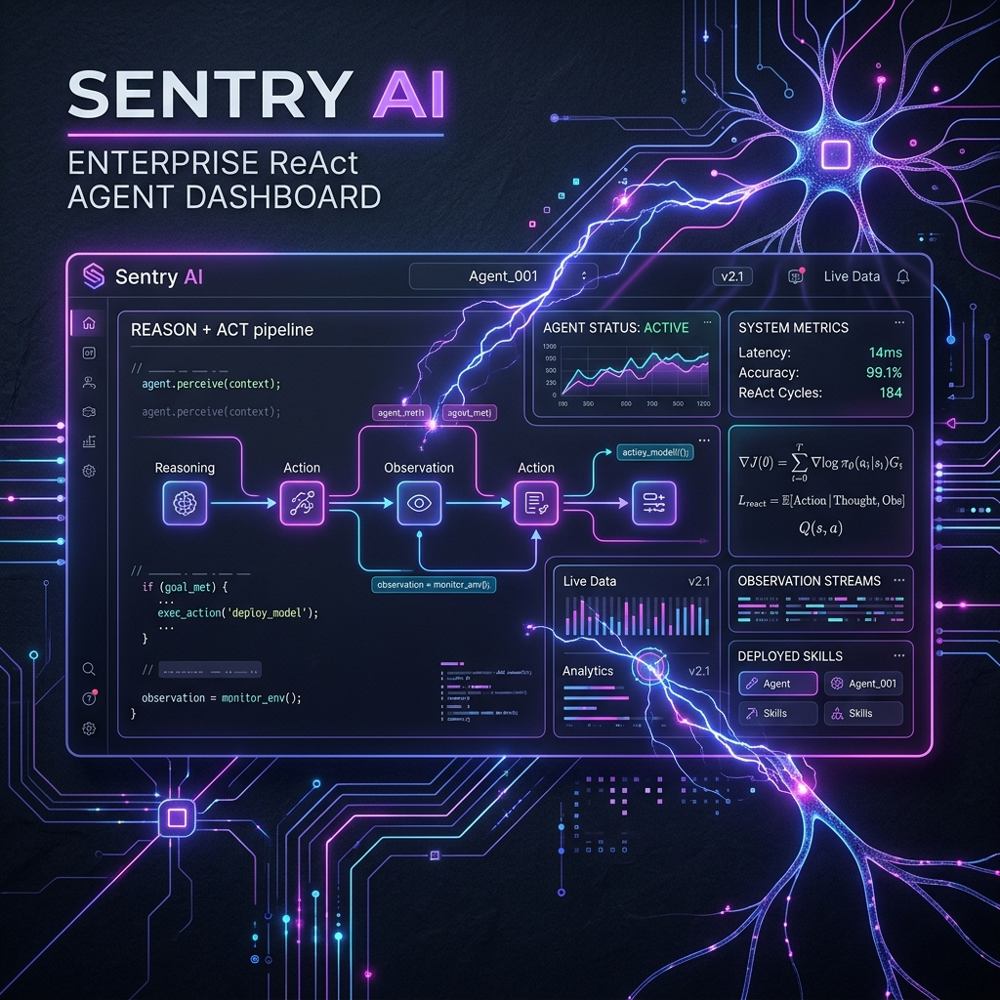

# 📢 LinkedIn Post Copy: Sentry AI Release (Ultra-Condensed Version)

Below is the condensed copy for your LinkedIn post, fully optimized to fit within LinkedIn's **3,000-character limit** (approx. 1,980 characters total). The headings are formatted in native bold Unicode.

---

### 🖼️ UHD Visual Banner (Upload this with your post)

---

## 📝 LinkedIn Post Text Copy

🚀 𝗜 𝗷𝘂𝘀𝘁 𝗯𝘂𝗶𝗹𝘁 𝘁𝗵𝗶𝘀: 𝗦𝗲𝗻𝘁𝗿𝘆 𝗔𝗜 — 𝗔 𝗖𝗼𝗻𝘀𝗼𝗹𝗶𝗱𝗮𝘁𝗲𝗱 𝗘𝗻𝘁𝗲𝗿𝗽𝗿𝗶𝘀𝗲 𝗥𝗲𝗔𝗰𝘁 𝗗𝗮𝘀𝗵𝗯𝗼𝗮𝗿𝗱

Built strictly for educational purposes to share my knowledge and explore advanced AI orchestration with the engineering community, Sentry AI is a state-of-the-art implementation of the **ReAct (Reasoning and Acting)** paradigm for multi-step enterprise workflows.

Single-turn routers fail when faced with complex, dependent calculations—like multiplying prices before calculating taxes. An LLM cannot write the tax tool arguments until it knows the multiplication result. ReAct solves this by interleaving thoughts, actions (tool calls), and observations (outputs) in an autonomous loop.

🧠 𝗞𝗲𝘆 𝗖𝗮𝗽𝗮𝗯𝗶𝗹𝗶𝘁𝗶𝗲𝘀:
* 🚀 **Multi-Step Tool Chaining**: Chains geocoding and live weather forecasts dynamically to advise on travel warnings.
* 💾 **NL-to-SQL DB**: secure, read-only SELECT queries over product catalogs, blocking mutation keywords.
* 🛡️ **Self-Healing**: Handles spelling errors (e.g. asking for "pric" instead of "price") or divide-by-zero errors gracefully by feeding logs back to the LLM for automated retries.
* 🔌 **Headless Adaptability**: Automatically detects non-interactive child subprocess environments to prevent execution hangs.

🛠️ 𝗧𝗵𝗲 𝗧𝗲𝗰𝗵 𝗦𝘁𝗮𝗰𝗸:
* **LLM Core**: DeepSeek Chat (`deepseek-chat` / `ChatDeepSeek`).
* **Agentic Orchestration**: LangChain (`create_agent` and manual orchestrator loops).
* **API Gateway**: FastAPI (Modular APIRouter, asynchronous backend).
* **UI/Frontend**: React Vite (glassmorphism design) & Gradio (dual-tab explorer).

⚙️ 𝗛𝗼𝘄 𝗜𝘁 𝗪𝗼𝗿𝗸𝘀: 𝗧𝗵𝗲 𝗠𝗲𝗰𝗵𝗮𝗻𝗶𝗰𝘀 𝗼𝗳 𝗧𝗼𝗼𝗹 𝗖𝗮𝗹𝗹𝗶𝗻𝗴:
1. **JSON Schema Binding**: Python functions (type hints/docstrings) compile into JSON Schemas bound to the LLM.
2. **Routing (THINK)**: The LLM processes the query and outputs a JSON routing payload (e.g., `calculate(expression="347*86")`).
3. **Execution (ACT)**: The Python orchestrator captures this JSON and runs the local Python function securely.
4. **Feedback (OBSERVE)**: The result is wrapped in a `ToolMessage` and appended to chat history. The LLM reflects on the observation to generate the final conversational reply.

📚 𝗧𝗵𝗲 𝟭𝟭-𝗠𝗼𝗱𝘂𝗹𝗲 𝗥𝗲𝗔𝗰𝘁 𝗦𝘆𝗹𝗹𝗮𝗯𝘂𝘀:
* **01**: Limitations of Raw LLMs | **02**: Concept of Tool Calling | **03**: The ReAct Paradigm | **04**: Under-the-Hood ReAct Loop | **05**: LangChain `create_agent` | **06**: Custom Tool Design | **07**: API Chaining | **08**: NL-to-SQL DB | **09**: Programmatic Traces | **10**: Tool Resiliency | **11**: Graduation Dashboard

This project shows how we can transition from static prompts to resilient, multi-turn cognitive loops that enable AI to solve complex, real-world business logic.

#AI #GenerativeAI #ReActParadigm #AIReasoning #LangChain #FastAPI #SentryAI #Python #SoftwareEngineering #AgenticAI
